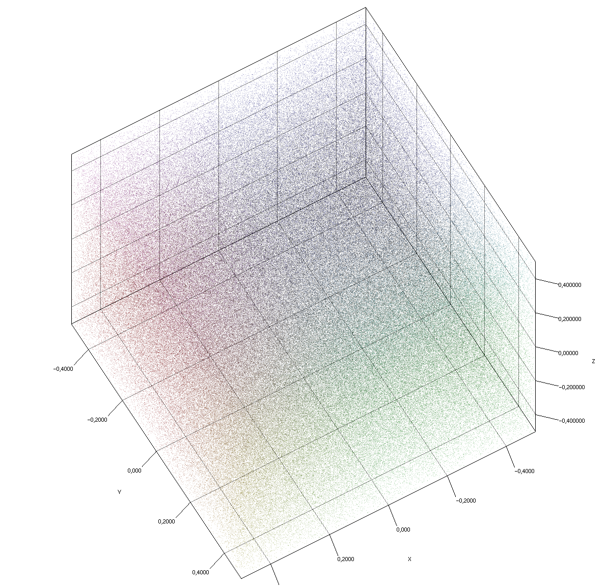
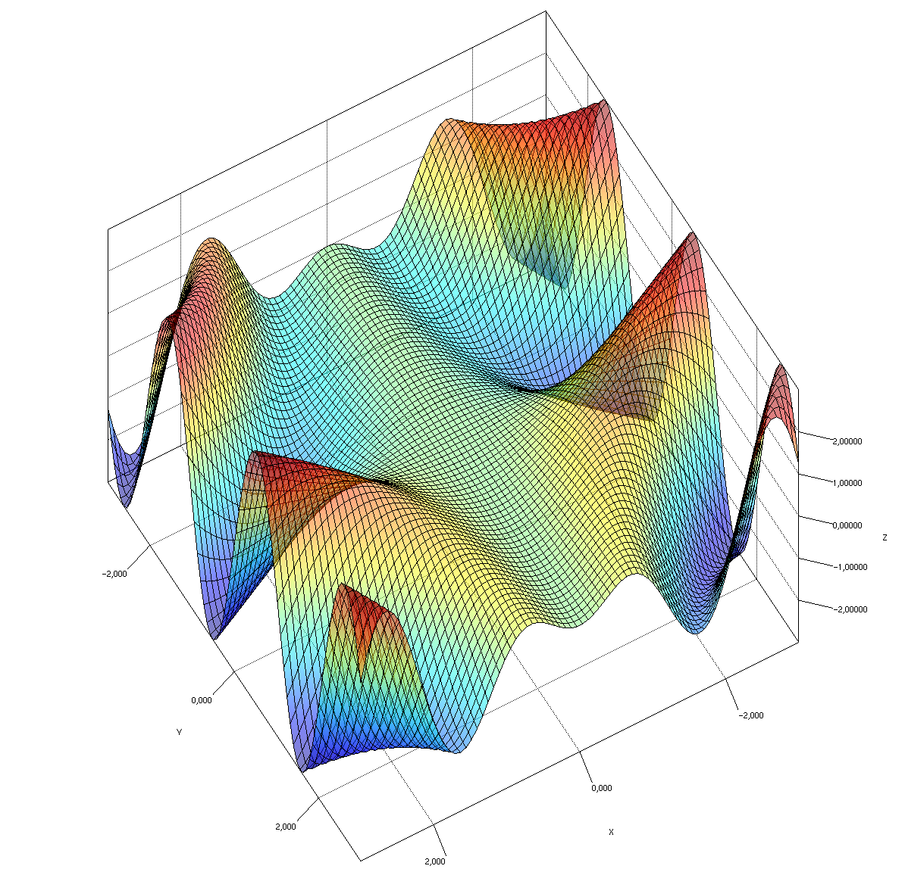
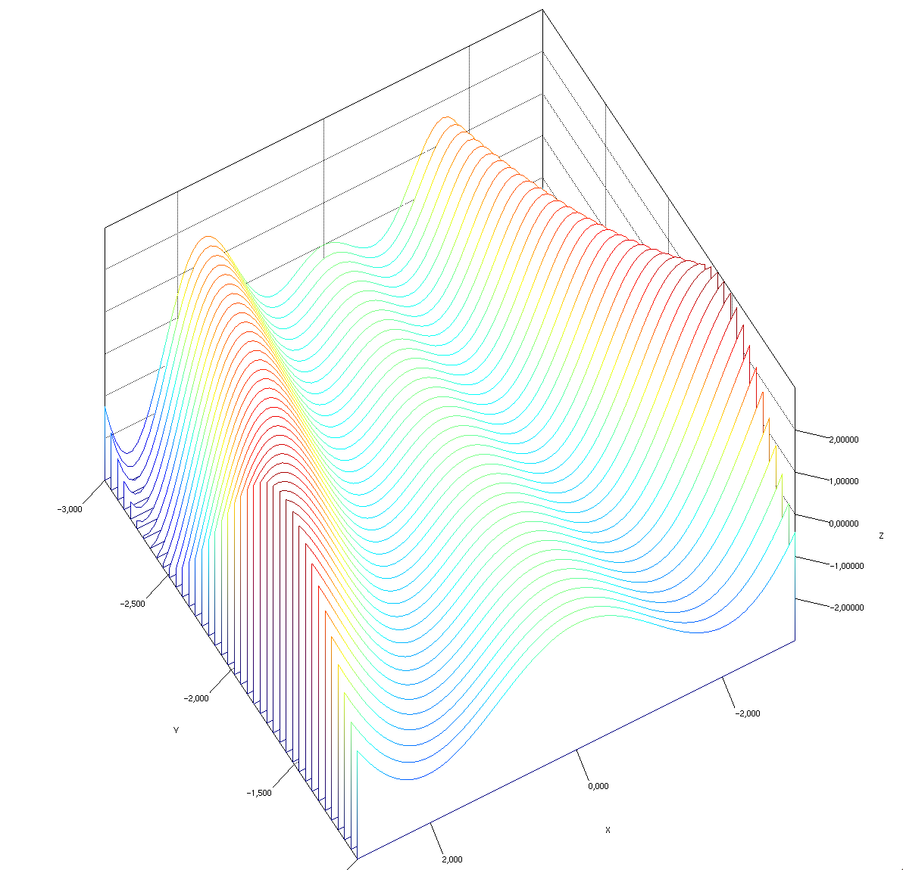
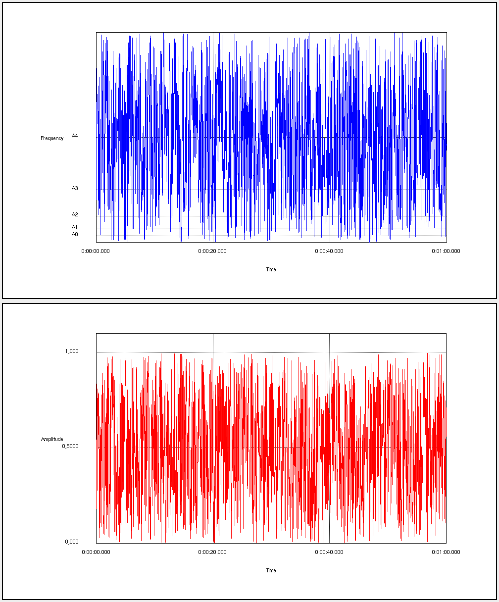
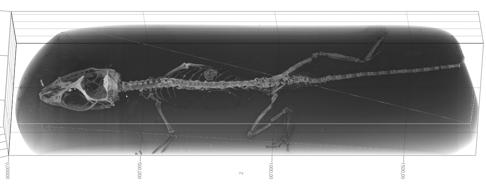

Jzy3d
=========

Jzy3d is a framework for easily drawing 3d and 2d charts in Java, using either fast native GPU rendering or CPU based rendering to enhance portability across combination of OS/JVM/GPU.

The framework targets simplicity and portability across Java windowing toolkits (AWT, SWT, NEWT, Swing, JavaFX, Offscreen rendering), running either on MacOS, Windows and Linux. Jzy3d is available for other languages or platforms such as [Scala, Groovy, Matlab](http://jzy3d.org/community.php), [C#](https://github.com/jzy3d/nzy3d-api), and even [Python](https://github.com/jzy3d/pyzy3d).  

The API can be used [freely in commercial applications](license.txt). You can explore the [tutorials](jzy3d-tutorials). an then purchase the [extended developper guide](http://jzy3d.org/guide.php) to support the development effort.


# How to use

Refer to the [tutorial README](jzy3d-tutorials/README.md) file to get help on creating your first chart project with the help of example code.

<table markdown=1>
  <tr>
    <td></td>
    <td></td>
    <td></td>
    <!--<td colspan="2"></td>-->

  </tr>
  <tr>
<!--      <td></td>
    <td></td>
-->
<td colspan="2"></td>
<td></td>
  </tr>
</table>

As this library focuses on portability of the charts, the `org.jzy3d.demos.surface` package in [jzy3d-tutorials](jzy3d-tutorials) demonstrates the same chart running on AWT, SWT, Swing using native OpenGL powered by JOGL and jGL CPU rendering.

```java
public class SurfaceDemoAWT extends AWTAbstractAnalysis {
  public static void main(String[] args) throws Exception {
    SurfaceDemoAWT d = new SurfaceDemoAWT();
    AnalysisLauncher.open(d);
  }

  @Override
  public void init() {
    // Define a function to plot
    Mapper mapper = new Mapper() {
      @Override
      public double f(double x, double y) {
        return x * Math.sin(x * y);
      }
    };

    // Define range and precision for the function to plot
    Range range = new Range(-3, 3);
    int steps = 80;

    // Create the object to represent the function over the given range.
    final Shape surface = new SurfaceBuilder().orthonormal(new OrthonormalGrid(range, steps), mapper);
    surface.setColorMapper(new ColorMapper(new ColorMapRainbow(), surface, new Color(1, 1, 1, .5f)));
    surface.setFaceDisplayed(true);
    surface.setWireframeDisplayed(true);
    surface.setWireframeColor(Color.BLACK);

    // Create a chart
    GLCapabilities c = new GLCapabilities(GLProfile.get(GLProfile.GL2));
    IPainterFactory p = new AWTPainterFactory(c);
    IChartFactory f = new AWTChartFactory(p);

    chart = f.newChart(Quality.Advanced);
    chart.getScene().getGraph().add(surface);
  }
}
```

# What's inside

## Features

Multiple chart types
* Surface charts
* Scatter charts
* Volume charts
* Bar charts
* 3D and 2D graphs charts
* Many primitives to build custom charts (spheres, triangles, polygons, ...)


<table>
<tr>
<td></td>
<td></td>
<td></td>
</tr>
</table>


Flexible layout
* Colorbars
* Colormappers for coloring objects
* Axis box layout with detailed tick definition and tick rendering tools
* Contour functions
* Tooltips
* Background images
* 2D post renderers
* Lights

<table>
<tr>
<td></td>
<td></td>
<td></td>
</tr>
</table>


Algorithms
* Grid based and Delaunay surface tesselation methods
* 3d line strip interpolation to smooth pathes (Bernstein 3d)
* 2d envelopes (Convex hulls)
* Polygon ordering for improved transparency rendering
* Dual depth peeling: scene graph order independent transparency (expected for 1.0)
* Matlab-like array processors and statistics tools
* Experimental Support Vector Machine integration (Svm3d)

<table>
<tr>
<td></td>
<td></td>
<td></td>
</tr>
</table>


Interactions
* Mouse interaction with objects (selection & picking methods)
* Mouse interaction with chart (rotation, zoom, scale)
* Key interaction with chart (rotation, zoom, scale)
* Thread Controllers
* Animation of objects' structures (surface, series of lines, etc)

High and low level OpenGL programming
* Hide complexity and provide out of the box solutions for common low level OpenGL tasks
* Fully cutomizable framework with access to all OpenGL native features through JOGL

Cross platforms and compatible
* Straightforward integration to either AWT, Swing, Eclipse RCP (SWT), or JavaFX
* Windows, Unix, and MacOS. Android supposed to work if enable appropriate JOGL jars
* Offscreen rendering
* Multiple file formats (Ply, Obj, Matlab, CSV)
* [C#](https://github.com/jzy3d/nzy3d-api) port
* [Python](https://github.com/jzy3d/pyzy3d) binding
* [Scala](https://github.com/jzy3d/jzy3d-sbt) example
* [Matlab](https://fr.mathworks.com/matlabcentral/fileexchange/35026-opengl-3d-graphics-in-matlab-using-jzy3d-a-demo) integration

Extensions
* <a href="https://github.com/jzy3d/jzy3d-graphs">jzy3d-graph</a> : 3d graphs layout and rendering using Gephi toolkit
* <a href="https://github.com/jzy3d/jzy3d-spectro">jzy3d-spectro</a> : 3d spectrogram
* <a href="https://github.com/jzy3d/bigpicture">jzy3d-bigpicture</a> : drivers to few big data storage to draw massive amount of points


## Architecture

Creating a chart implies building and wiring the below high-level components.


### Customize chart with factories

The ```IChartFactory``` builds all objects that will define how the chart will look (```Axis```, ```View```, ```Camera```, ```Chart```).

The ```IPainterFactory``` builds every objects that allow compatibility across windowing toolkits and GPU/CPU. The chart factories and drawable have no knowledge of concrete AWT, SWT, Swing, etc. This is all powered by the painter factory introduced in Jzy3d 2.0.

The ```Drawable``` class hierarchy defines geometries able to use a ```IPainter``` to draw something.


### Native and emulated elements


## Dependent libraries

Jzy3d depends on the following libraries that are available on [Jzy3d Maven repository](http://maven.jzy3d.org) (See tutorials for recommended Maven setup)
* [jGL](https://github.com/jzy3d/jGL) provides a pure Java implementation of OpenGL hence allowing CPU rendering as an alternative to GPU rendering (JOGL)
* [jPLY](https://github.com/jzy3d/jPLY) supports the PLY format for loading 3d objects
* [vecmath](https://github.com/jzy3d/vecmath) is a clone of a former java package

# How to add to your project

The tutorial provides the code [samples you need to add the library to a Maven project](https://github.com/jzy3d/jzy3d-api/tree/master/jzy3d-tutorials#adding-dependencies).

### Download sources & javadocs in IDE

If you did not built the framework yourself and depend on Jzy3D Maven Repository, then you may wish to see sources and javadoc in your IDE. Simply call :

```
mvn dependency:resolve -Dclassifier=javadoc
mvn dependency:resolve -Dclassifier=sources
```


# How to build

## From command line

### Build all

#### Run unit tests only

This will run all test named `**/Test*.java` or `**/*Test.java`.

```
mvn clean install
```

#### Run unit tests and integration tests

Integration tests compare charts to baseline images pixel wise. They are important in te toolbelt but have the drawback of being less portable accross computers
* Different OS have different frame insets (changing actual rendering area size) leading to chart screenshots of different size accross OS.
* Different OS have different frame insets (changing actual rendering area size) leading to chart a different layout (colorbar position)
* Different OS have different font rasterization (despite using the JVM font raterizer to minimize OS impact), hence text labels do not match despite having only a few pixel difference.
* A non HiDPI chart screenshot will not have the same size than the baseline that was generated on a Retina display (x2 pixel ratio). Integration tests that may be impacted by HiDPI are gathered in `jzy3d-tests-java9` since at lest Java 9 JREs are required to detect HiDPI for EmulGL charts. 

This will run all test named `**/ITTest*.java` and unit tests.

```
mvn clean install -Pintegration-tests
```


#### Skip tests

This will skip all tests (unit and integration)
```
mvn clean install -DskipTests
```

### Deploy source & javadocs
```
mvn clean source:jar javadoc:jar deploy
 ```

### Generate javadoc site

Comment module jzy3d-tutorial manually

```
mvn compile javadoc:javadoc javadoc:aggregate
```

## From intellij

Follow these steps to import in IntelliJ
* open an existing unrelated project
* file->new project from version control
* close the imported project window
* from the unrelated project ->file-> new project from existing sources -> select the new projects location
* from new project select top -> file -> add framework-> maven
* file -> set module language level

## From eclipse

`Import Maven project` or `Import Maven project from SCM`


# How to get help

* Google [Discussion group](https://groups.google.com/g/jzy3d?pli=1)
* Gitlab [Discussions](https://github.com/jzy3d/jzy3d-api/discussions)
* StackOverflow [Tag](https://stackoverflow.com/questions/tagged/jzy3d)
* If you are looking for professional services related to 3d rendering, contact [me](martin@jzy3d.org)


# Changes in 2.0 version

Version 2.0 is a major refactor to allow using multiple OpenGL implementations, which opened the door to EmulGL. To ease porting your 1.* charts, we add the following cheatsheet.

## Renamings

| Class name in 1.* | Class name in 2.0 |
|-------------------|-------------------|
| Quality.Advanced, Intermediate | Quality.Advanced(), Intermediate() |
| AbstractDrawable | Drawable |
| AbstractWireframeable | Wireframeable |
| AxeBox | AxisBox |
| DrawableTexture | NativeDrawableImage & EmulGLDrawableImage |
|||
| _IChartComponentFactory_ | _IChartFactory_ |
| AWTChartComponentFactory | AWTChartFactory |
| NewtChartComponentFactory | NewtChartFactory |
| JavaFXChartComponentFactory | :exclamation: JavaFXChartFactory |
| SwingChartComponentFactory | SwingChartFactory |
| SWTChartComponentFactory | SWTChartFactory |
|  | FallbackChartFactory |
|||
| ColorbarViewportLayout | ViewAndColorbarsLayout |
| ViewMouseController | NewtViewCameraController |
| Halign | Horizontal |
| Valign | Vertical |
| Surface | SurfaceBuilder |

:exclamation: work in progress.

SurfaceBuilder is not static anymore to be overridable.


## Additions

* `IPainter`
* `IPainterFactory`
* `EmulGLPainterFactory`
* `IAnimator`
* `IImageWrapper` and `SymbolHandler`


## Deletions


<!--Travis build status : [](https://travis-ci.org/jzy3d/jzy3d-api)-->
