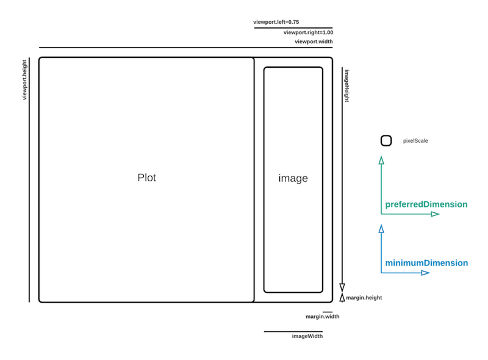
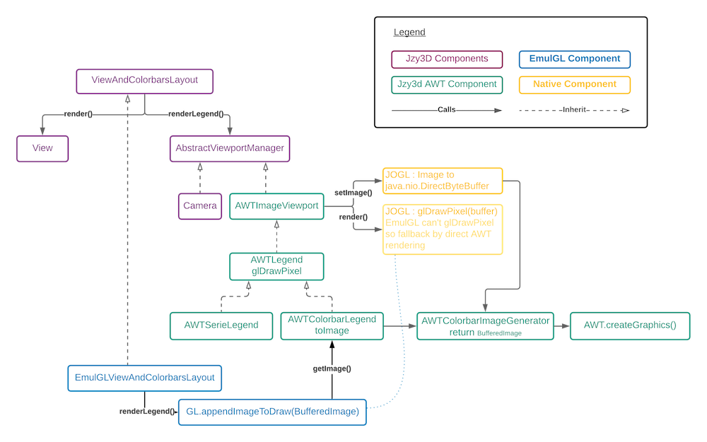

Jzy3d - Core AWT
================================

Provides AWT components at the core level, meaning independent of JOGL or EmulGL.

* Mouse and keyboard controllers implemented with AWT `MouseListener` and `KeyListener`)
* Image rendering (based on AWT `BufferedImage`)
* Overlays, tooltips, legends and colorbars rendering (based on AWT `Graphics2D`)
* Conversions AWT<>Jzy3D (colors, fonts, etc)

## Javadoc schemas

### Colorbar

#### Layout

#### Model

