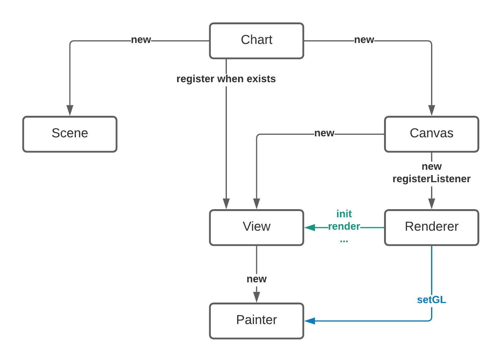
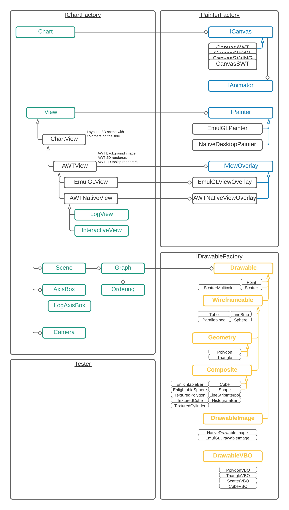
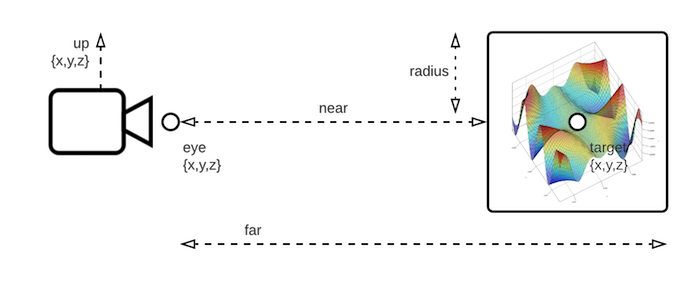
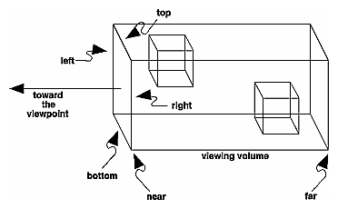
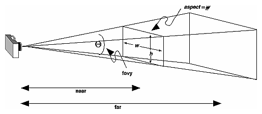
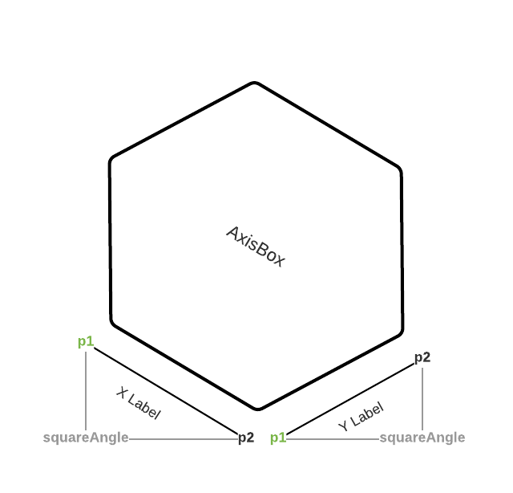
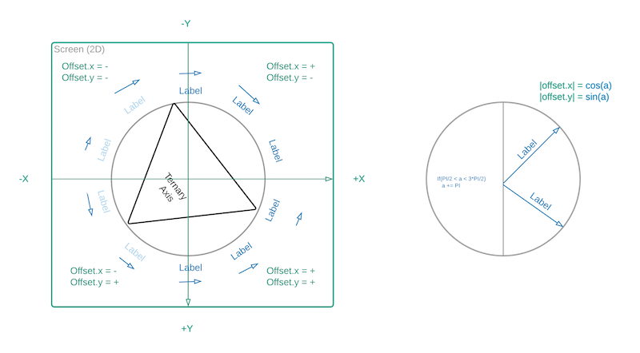

Jzy3d - Core
================================

Provides the base definition of charts without the rendering backend that may be implemented by JOGL (in all module named `jzy3d-native-jogl-*`) or EmulGL (in `jzy3d-emul-gl-*`).


## Software Architecture

Creating a chart implies building and wiring the below high-level components.




### Customize chart with factories

The ```IChartFactory``` builds all objects that will define how the chart will look (```Axis```, ```View```, ```Camera```, ```Chart```).

The ```IPainterFactory``` builds every objects that allow compatibility across windowing toolkits and GPU/CPU. The chart factories and drawable have no knowledge of concrete AWT, SWT, Swing, etc. This is all powered by the painter factory introduced in Jzy3d 2.0.

The ```Drawable``` class hierarchy defines geometries able to use a ```IPainter``` to draw something.


### Native and emulated elements




## Javadoc schemas reference

### Camera

#### Model


#### Orthogonal projection


#### Perspective projection


### Axis

#### AxisLabelRotator

##### Cube Axis


##### Ternary Axis

