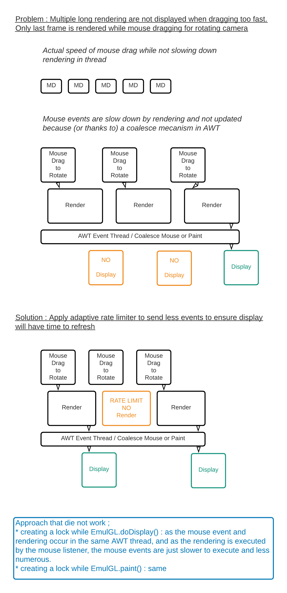
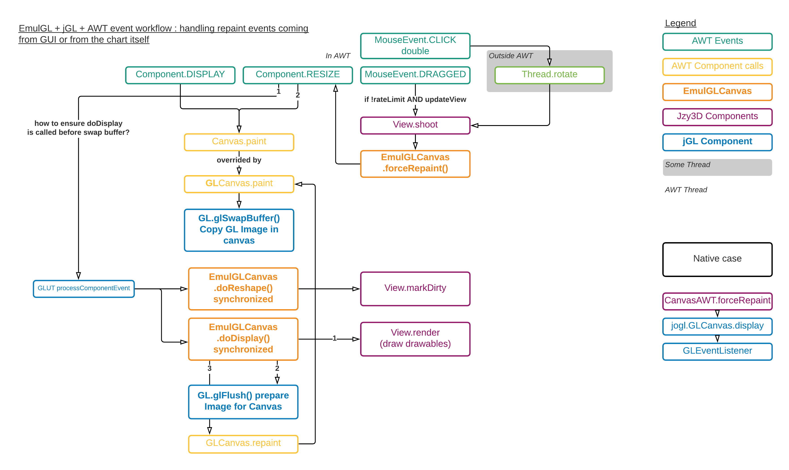

EmulGL
=========

EmulGL is a Java implementation of OpenGL running *C*PU, hence allowing to avoid using native dependencies to *G*PU.

Traditional GPU rendering offers great performance but sometimes hit a compatibility issue for some rare {OS, JDK, GPU} combination. EmulGL processes the 3D scene inside the JVM with Java code only with rendering time below 40ms for most surface and scatter charts. This makes EmulGL a good fallback renderer for both offscreen chart and onscreen interactive chart that may be animated without visible lag (and without flooding CPU either).

EmulGL relies on [jGL](https://github.com/jzy3d/jzy3d-api/tree/master/jzy3d-jGL), a pure Java implementation of the OpenGL 1 specification. EmulGL remains relevant for simple charts.

Native charts (using JOGL) remain the preferred option for fast rendering of very large geometries, volumes or rendering involving shaders. Native charts also tend to better handle alpha blending (using translucent objects).

# Performance

Despite not exhaustive at all, I was able to have the following performance on a MacBook Pro (Retina 15 inches, 2013), 2,7 GHz Intel Core i7, RAM 16 Go 1600 MHz DDR3

[EmulGL Surface charts](https://github.com/jzy3d/jzy3d-api/blob/master/jzy3d-tutorials/src/main/java/org/jzy3d/demos/surface/SurfaceDemoEmulGL.java)
* A 60x60 polygon 3D surface in a 500x500 pixels frame is rendered in ~30ms
* A 60x60 polygon 3D surface in a 1440x800 pixel frame is rendered in ~45ms

[EmulGL Scatter charts](https://github.com/jzy3d/jzy3d-api/blob/master/jzy3d-tutorials/src/main/java/org/jzy3d/demos/scatter/ScatterDemoEmulGL.java)
* A 50.000 points 3D scatter in a 500x500 pixels frame is rendered in ~10ms
* A 500.000 points 3D scatter in a 500x500 pixels frame is rendered in ~90ms

Please report here the performance you encounter while running EmulGL charts by [adding comments to this issue](https://github.com/jzy3d/jzy3d-api/issues/149).

# Tuning performance

The quick hints to play with performance are below, if you are willing to understand how these parameters affect performance, read the next section.

## Reducing rendering quality in favor of faster repaint

```java
Quality q = Quality.Advanced;
q.setPreserveViewportSize(true); // prevent HiDPI/Retina to apply hence reduce the number of pixel to process

Chart chart = factory.newChart(q);

```

## Reducing liveness in favor of less CPU usage

```java
Quality q = Quality.Advanced;
q.setAnimated(false); // avoid rendering continuously, especially when chart does not need to change (most often)

Chart chart = factory.newChart(q);
```


## Improving rendering quality with possible liveness issues

```java
Quality q = Quality.Advanced;
q.setPreserveViewportSize(false); // Let HiDPI/Retina inform their pixel ratio to process GL image on more pixels
q.setAnimated(true); // requires the mouse, keyboard and thread events to be rate limited to avoid AWT congestion

Chart chart = factory.newChart(q);
```

# Repaint on demand VS repaint continuously

Repaint on demand means refreshing the canvas if at least one pixel changes. This is less CPU intensive in the long term as
chart are only changed if user interacts with it, add elements, or if the application resizes. Repainting on demand requires
however a carefull management of events that is exposed below and shows liveness issues in some rare conditions.

Repainting continuously allows getting rid off all these issues : a CPU thread will run [at a mean rate](https://github.com/jzy3d/jzy3d-api/blob/master/jzy3d-emul-gl/src/main/java/org/jzy3d/chart/EmulGLAnimator.java#L6) and ensure the chart always appear in the correct position without needing to handle refresh upon mouse, key or other thread events.

Setting repaint on demand is handled by
```java
Quality q = Quality.Advanced;
q.setAnimated(false);

Chart chart = factory.newChart(q);
chart.addMouseCameraController();
chart.addKeyboardCameraController();
```
Mouse, keyboard, and rotation thread controllers will behave according to the configuration (trigger repaint is repaint is
  on demand, do nothing if repaint continuously).

# Handling slow rendering

EmulGL/jGL run in CPU, hence the rendering performance remains sensitive to
* the number of pixels (the same Processing Unit must handle all pixels)
* the hardware capacity (HiDMI & Retina display may multiply the physicial number of pixels)
* the number of drawables to draw
* the number of rendering requests

In the worse conditions, rendering time may reach a visible duration (e.g. 200ms). In that case, policies must
be defined to avoid freezing AWT either for rendering or for handling interactions. The below sections explain why the JVM
brings limitations, and how EmulGL resolves them.

## Integrating in AWT

### Unpredictability of AWT

Integrating in AWT is tricky because of how AWT works and how it will react to multiple events. Such events may be
* canvas display & resize occuring in the embedding application
* mouse events
* keyboard events
* application events (e.g. a NON GUI class allows edit a 3D parameter triggering a new rendering outside the AWT Thread)

I discovered a few thing about non predictability of rendering upon reaction to these events. These are my understanding but *I may wrong*.
Please correct me via [an issue](https://github.com/jzy3d/jzy3d-api/issues) if I am!

#### You don't know when AWT will really render

AWT send rendering or interaction events (mouse, ...) to the EventQueue.
The JVM will decide when it will be actually displayed.
I found no event or hook to get notified when an update happens.


[Edit schema](https://lucid.app/lucidchart/78ec260b-d2d1-430d-a363-a95089dae86d/edit?page=wz_twV5gX99-#)

#### You can't be sure that all events will all be handled independently

The [EventQueue has the ability to coalesce multiple mouse or paint event](https://docs.oracle.com/javase/8/docs/api/java/awt/EventQueue.html#postEvent-java.awt.AWTEvent-)
in case it becomes overwhelmed by queries that it had no time to handled.

As a consequence, in the case multiple rotation command triggered by a mouse drag event -
and if these event lead to slow rendering, then you may only see the last rendering and not all intermediate images.
In that case, it is necessary to limit the event rate to ensure not too many rendering are triggered (said
differently, that repaint query are not arriving faster than the ability to compute what should
be drawn).



[Edit schema](https://lucid.app/lucidchart/78ec260b-d2d1-430d-a363-a95089dae86d/edit?page=IG_tq9NVLe03#)

All windowing toolkit event are not coalesced! For example the mouse wheel events do not seam to be coalesced, whereas mouse dragged events are.

#### Actual rendering in AWT

Rendering of AWT components is made with... OpenGL! But it is limited to 2D graphics only.

## EmulGL canvas

The below map describes how EmulGL canvas replies to these events.




[Edit schema](https://lucid.app/lucidchart/78ec260b-d2d1-430d-a363-a95089dae86d/edit?page=IG_tq9NVLe03#)


# Remarks

## HiDPI

EmulGL supports HiDPI rendering by enabling a chart with `Quality.setPreserveViewportSize(false);`
(which actually forbids to preserve the usual pixel ratio in case a HiDPI configuration is detected)


We noticed the following limitations with HiDPI on EmulGL as it is currently implemented
* I noticed that HiDPI may not trigger on Java 8, whereas it works on Java 9. Jzy3d is intentionally build for Java 8 to remain compatible with "old" software. This does not prevent a software running on Java 9 to use HiDPI automatically. This is highlighted by `ITTestHiDPI` that is kept as a program with main() rather than junit test.
* HiDPI in jGL is detected at runtime and that chart will properly scale to HiDPI after a first rendering. A chart configured with `chart.setAnimated(true)` and `Quality.setPreserveViewportSize(false);` will automatically turn to HiDPI at the second frame.
* Offscreen charts currently do not seem to adapt to HiDPI automatically. This may be due to the way I do the HiDPI detection in jGL that relies on the state of the *displayed* AWT Canvas. Anyway, no offscreen HiDPI make it *impossible to create non regression tests about HiDPI* at this step. Even if this would be supported, there would be limitation with build since such kind of tests should be ignored on computer that do not have the same HiDPI capabilities than the computer used to generate the baseline image, which is not possible with current maven build.

Usefull links about HiDPI and java
* https://bugs.openjdk.java.net/browse/JDK-8055212
* https://intellij-support.jetbrains.com/hc/en-us/articles/360007994999-HiDPI-configuration
* https://cwiki.apache.org/confluence/display/NETBEANS/HiDPI+%28Retina%29+improvements

# Further work

## Fail : Performance with multithreading

We explored multithreaded rendering in SurfaceDemoEmulGL_Multithreaded which is a complete failure. jGL  
won't support multithreading easily. OpenGL indeed requires a consistent call to a serie of commands (glBegin, glVertex, glEnd, etc) that prevent multiple
threads to deal with a sub group of geometries to render since the GL context will receive commands from multiple interlaced geometries.
Note that JOGL has the same limitation. We explored Newt canvas in JOGL supposed to allow such multithreaded access to the same OpenGL context but did not succeed.

Performance studies shows that handling all geometries draw() method is where an optimization may be done. Handling copy of colorbuffer to the canvas is negligeable compared
to handling all OpenGL drawing primitives.
