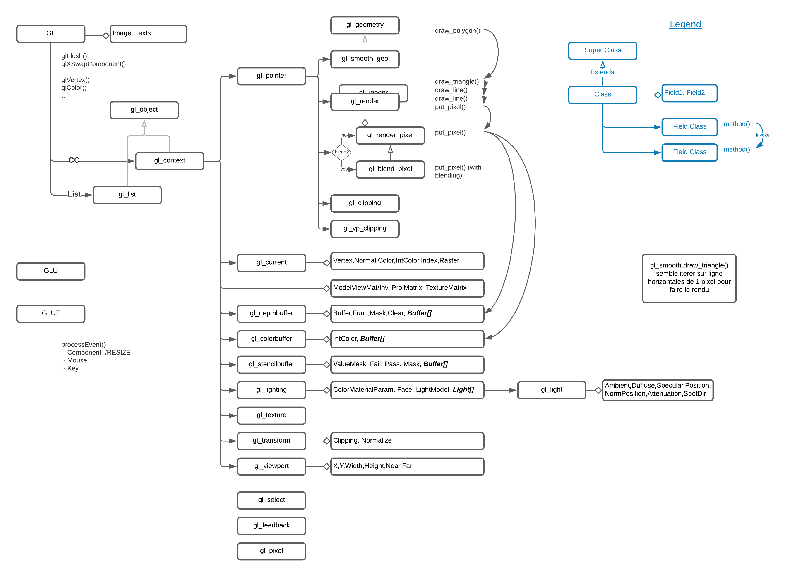
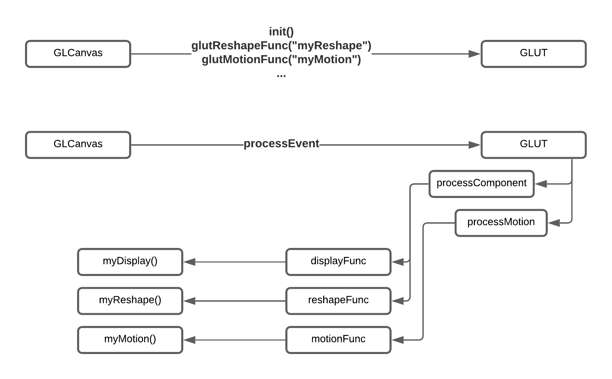

# jGL

A pure Java implementation of OpenGL, still [online](http://graphics.im.ntu.edu.tw/~robin/jGL/) with [example gallery](http://graphics.im.ntu.edu.tw/~robin/jGL/Example/index.html) and an [LGPL licence](http://www.gnu.org/licenses/lgpl-3.0.html)


# History

[jGL](http://www.cmlab.csie.ntu.edu.tw/~robin/jGL/) was created by Robin Bing-Yu Chen in 1996 and has been maintained up to 2006. 
It is a pure java implementation of OpenGL 1, hence performing 3d rendering with CPU instead of GPU. 
Some papers about jGL published by Robin have been added to the `doc/papers` folder which clarify all his work.
It comes with [lot of OpenGL Red Book examples](http://www.cmlab.csie.ntu.edu.tw/~robin/jGL/Example-app/index.html) proving how well
this OpenGL implementation works. The examples are released as [AWT applications](https://github.com/jzy3d/jGL/tree/master/src/main/java/examples/apps)
and [Applets](https://github.com/jzy3d/jGL/tree/master/src/main/java/examples/applets).


In 2020, CPU are much more faster than in 2006 and experiments have showned that one can get very decent rendering 
performance for simple 3D scenes showing surface or scatter point charts. Despite not exhaustive at all, I was able 
to have the following performance on a MacBook Pro (Retina 15 pouces, début 2013), 2,7 GHz Intel Core i7, RAM 16 Go 1600 MHz DDR3
- A 60x60 polygon 3D surface in a 500x500 pixels frame is rendered in ~30ms. 
- A 60x60 polygon 3D surface in a 1440x800 pixel frame is rendered in ~45ms
- A 50.000 points 3D scatter in a 500x500 pixels frame is rendered in ~10ms.
- A 500.000 points 3D scatter in a 500x500 pixels frame is rendered in ~90ms.

This performance is far from competing with native rendering performance as offered by the JOGL framework. 
I however faced situations I call "the native hell" where very specific combination 
of OS, JVM & GPU versions triggers [JVM warning and crashes](https://github.com/jzy3d/jzy3d-api/issues/128).

This led to integrate jGL in [Jzy3D](http://www.jzy3d.org/) as a fallback rendering backend. This goal in mind allowed to improve the 
framework which is now in version 2.5. In addition to adding features, this was an opportunity to add 
[test cases to jGL](https://github.com/jzy3d/jGL/tree/master/src/test/java/jgl) to 
truly debug and understand how the color buffer changes according to various GL configurations. 

Despite a strong motivation for enhancing Jzy3D, I kept jGL in a distinct repository to let anyone work with it without
depending on Jzy3D.

Appart of being an interesting alternative for simple 3D charts rendering, jGL is an excellent school for understanding how 
OpenGL works inside, as the source code is well organized and readable. 

The Architecture section will help anyone willing to dive in the library code.
 
# Architecture

This section provides insights about jGL main class architecture. The goal of these schema is to help a developer understand 
which software block handle which part of the OpenGL specification.


## GL

GL is a java object that implements OpenGL 1 specification.

The beginner 3D developer should understand the very basic of a 3D rendering pipeline
* Defining 3D geometries in the model view matrix.
* Performing a 2D projection with the projection matrix, possibly applying alpha blending, lightning, etc.
* Mapping the 2D projection to a viewport, in other word drawing to an image of given size on the screen.

The below schema illustrate which classes and datamodel element handle which part of the above simplified workflow. 


<a href="https://lucid.app/lucidchart/78ec260b-d2d1-430d-a363-a95089dae86d/edit?page=rUUJ25QAVSeR#?folder_id=home&browser=icon">Edit schema</a>

## GLUT

GLUT is a java object that implements OpenGL 1 specification.

GLUT helps wiring mouse and keyboard to the display loop of a Canvas.


<a href="https://lucid.app/lucidchart/78ec260b-d2d1-430d-a363-a95089dae86d/edit?page=L~uKE4~S_W9d#?folder_id=home&browser=icon">Edit schema</a>


## Important thing to know when trying to paint often

AWT repaint of all components are asynchronous. You do not decide when the component will draw.
Calling Component.repaint() too often might not lead  to a refreshing screen. Calling repaint() sends events to AWT
asking to draw when it can. If too many events are sent, the AWT event queue will coalesce all events into the last
one (or the one that requires painting the biggest part of the screen).

Refreshing the screen should be handled carefully. For example you can not simply update the screen as soon as the
mouse drags or move if building and drawing the 3d image takes to much time.

Despite not knowing exactly what is too much, I observed that having a rendering time above 40ms will lead to no
rendering at all until the Paint event  

# Maven Repository

You should add this to your pom file dependencies node, using the latest Jzy3d version:

```
<dependency>
    <groupId>org.jzy3d</groupId>
    <artifactId>jGL</artifactId>
    <version>2.0.0-SNAPSHOT</version>
</dependency>
```


Note that the repository was formerly standalone and versioned following Robin version, hence to V 2.5

Maven artifacts are stored there (you should add this to your pom file root):

```
<repositories>
    <repository>
        <id>jzy3d-snapshots</id>
        <name>Jzy3d Snapshots</name>
        <url>http://maven.jzy3d.org/snapshots/</url>
    </repository>
    <repository>
        <id>jzy3d-releases</id>
        <name>Jzy3d Releases</name>
        <url>http://maven.jzy3d.org/releases/</url>
    </repository>
</repositories>
```

# Features added to jGL since 2.5

### Error management

Ability to trigger runtime exception with stack trace when jGL interpret an OpenGL error.

```java
public abstract class gl_object {

	/**
	 * If true, will notify of any OpenGL error according to the configuration of
	 * {@link gl_object#exception}
	 */
	protected final boolean debug = true;
	/**
	 * If true, will trigger a {@link RuntimeException} upon any OpenGL error,
	 * otherwise send message to System.err.println(). In case
	 * {@link gl_object#debug} is set to false, all OpenGL errors are muted.
	 */
	protected final boolean exception = true;
}
```

Can debug using

```java
GLCanvas.postRenderString(Graphics g, String message, int x, int y);
```

or below mentionned 2d text management


### Text management : enable glutBitmapString-like text rendering.

Uses AWT Graphics2D.drawString() to draw text on top of the OpenGL color buffer (which is irself rendered in an image before) when glFlush() is invoked.

```java
/**
 * To be called by {@link GLUT#glutBitmapString(Font, String, float, float)} to
 * append text to a list of text to render at {@link GL#glFlush()} step.
 */
GL.appendTextToDraw(Font font, String string, int x, int y) ;
GL.appendTextToDraw(Font font, String string, int x, int y, float r, float g, float b)

```

Also


### Fix clear color by drawing the clear color in G2D.

This is not clean but we could not identify how to make background color work properly when integrating in Jzy3d (clear color was not applied and let instead a weird alpha value on pixel that are not rendered into by the scene).


### Image rendering based on AWT

to workaround the limitation of not being able place the image in screen using glRasterPos that jGL does not implement.


```java
GL.appendImageToDraw(BufferedImage image, int x, int y);
```
is added to let
 ```java
GL.glFlush()
```
 draw a BufferedImage on top of the OpenGL color buffer (the 3d scene).


## Limitations observed with jGL while embedding in Jzy3d

* Can not "mix" two viewports standing next to each other. The last rendered viewport erase the preceding. If the second viewport does not render ON TOP of the first one, the first one is replace by the clear (?) color.
* glRasterPos is not implemented in jGL, which is annoying for positioning a 2d image that should be rendered with glDrawPixels. See GL.appendImageToDraw

### Following bug appear when integrated in Jzy3d, but not in standalone prototypes

* glClear does not properly clear image background. Instead the background remains translucent AND multiple successive images overlap. Adressed by painting background with AWT fillRect
* Alpha blending not working properly. When integrating in Jzy3d, Elements with Alpha=0 appear as black instead of fully translucent. 


# Javadoc and UML documentation
Javadoc with UML generated with [yFiles Doclet tool](https://www.yworks.com/downloads#yDoc).
Configuration file in doc/yfiles.uml.options.jgl.linux
Run ```javadoc @/Users/martin/Dev/jzy3d/public/jGL/doc/uml/yfiles.uml.options.jgl.linux```


 
# Features

|Name          |Tested |Integrated in Jzy3D|Version| 
----------------------------------------------------
|Alpha blending|Yes    |Yes                |2.5    | 
|Text          |Yes    |Yes                |2.5    |
|Lightning     |No     |No                 |2.4    | 
 

