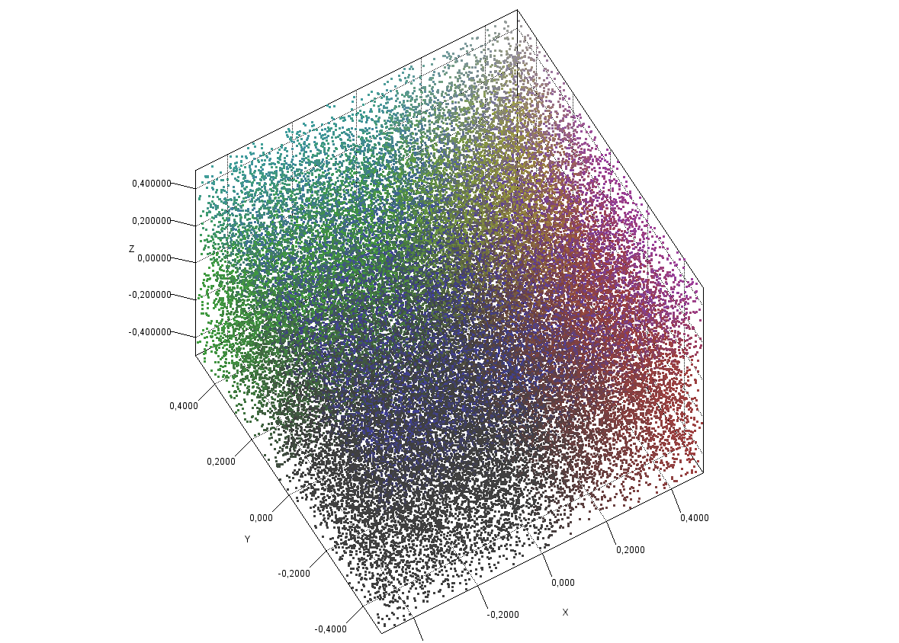
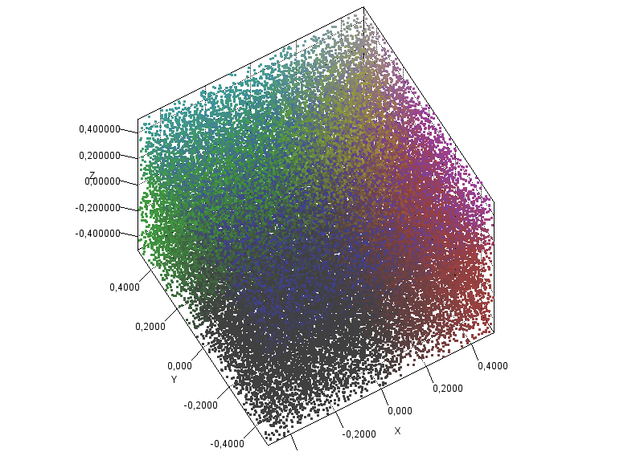
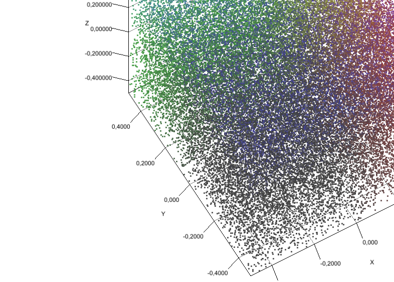

jzy3d-test-java9-generated
==========================
This is a summary of existing baseline images for tests, which was generated on 
* OS Name : windows 10
* OS Version : 10.0
* Java Version : 17.0.1
* CPU : amd64
* GPU : IntelIrisXeGraphics

# Surface
<table markdown=1>
<tr>
<td>EmulGL_AWT HiDPI:ON</td>
<td>EmulGL_AWT HiDPI:OFF</td>
<td>Native_AWT HiDPI:ON</td>
<td>Native_AWT HiDPI:OFF</td>
<td>Native_Swing HiDPI:ON</td>
<td>Native_Swing HiDPI:OFF</td>
</tr>
<tr>
<td></td>
<td></td>
<td></td>
<td></td>
<td></td>
<td></td>
</tr>
</table>

# Scatter
<table markdown=1>
<tr>
<td>EmulGL_AWT HiDPI:ON</td>
<td>EmulGL_AWT HiDPI:OFF</td>
<td>Native_AWT HiDPI:ON</td>
<td>Native_AWT HiDPI:OFF</td>
<td>Native_Swing HiDPI:ON</td>
<td>Native_Swing HiDPI:OFF</td>
</tr>
<tr>
<td></td>
<td></td>
<td></td>
<td></td>
<td></td>
<td></td>
</tr>
</table>

# Text
<table markdown=1>
<tr>
<td>EmulGL_AWT HiDPI:ON</td>
<td>EmulGL_AWT HiDPI:OFF</td>
<td>Native_AWT HiDPI:ON</td>
<td>Native_AWT HiDPI:OFF</td>
<td>Native_Swing HiDPI:ON</td>
<td>Native_Swing HiDPI:OFF</td>
</tr>
<tr>
<td></td>
<td></td>
<td></td>
<td></td>
<td></td>
<td></td>
</tr>
</table>

# Text : whenDrawableTextRenderer
<table markdown=1>
<tr>
<td>EmulGL_AWT HiDPI:ON</td>
<td>EmulGL_AWT HiDPI:OFF</td>
<td>Native_AWT HiDPI:ON</td>
<td>Native_AWT HiDPI:OFF</td>
<td>Native_Swing HiDPI:ON</td>
<td>Native_Swing HiDPI:OFF</td>
</tr>
<tr>
<td></td>
<td></td>
<td></td>
<td></td>
<td></td>
<td></td>
</tr>
</table>

# AxisLabelRotateLayout
<table markdown=1>
<tr>
<td>EmulGL_AWT HiDPI:ON</td>
<td>EmulGL_AWT HiDPI:OFF</td>
<td>Native_AWT HiDPI:ON</td>
<td>Native_AWT HiDPI:OFF</td>
<td>Native_Swing HiDPI:ON</td>
<td>Native_Swing HiDPI:OFF</td>
</tr>
<tr>
<td></td>
<td></td>
<td></td>
<td></td>
<td></td>
<td></td>
</tr>
</table>

# Colorbar : Shrink
<table markdown=1>
<tr>
<td>EmulGL_AWT HiDPI:ON</td>
<td>EmulGL_AWT HiDPI:OFF</td>
<td>Native_AWT HiDPI:ON</td>
<td>Native_AWT HiDPI:OFF</td>
<td>Native_Swing HiDPI:ON</td>
<td>Native_Swing HiDPI:OFF</td>
</tr>
<tr>
<td></td>
<td></td>
<td></td>
<td></td>
<td></td>
<td></td>
</tr>
</table>

# Colorbar : ShrinkBigFont
<table markdown=1>
<tr>
<td>EmulGL_AWT HiDPI:ON</td>
<td>EmulGL_AWT HiDPI:OFF</td>
<td>Native_AWT HiDPI:ON</td>
<td>Native_AWT HiDPI:OFF</td>
<td>Native_Swing HiDPI:ON</td>
<td>Native_Swing HiDPI:OFF</td>
</tr>
<tr>
<td></td>
<td></td>
<td></td>
<td></td>
<td></td>
<td></td>
</tr>
</table>

# Colorbar : IsModifiedByCustomFont
<table markdown=1>
<tr>
<td>EmulGL_AWT HiDPI:ON</td>
<td>EmulGL_AWT HiDPI:OFF</td>
<td>Native_AWT HiDPI:ON</td>
<td>Native_AWT HiDPI:OFF</td>
<td>Native_Swing HiDPI:ON</td>
<td>Native_Swing HiDPI:OFF</td>
</tr>
<tr>
<td></td>
<td></td>
<td></td>
<td></td>
<td></td>
<td></td>
</tr>
</table>

# Colorbar : HasMinimumWidth
<table markdown=1>
<tr>
<td>EmulGL_AWT HiDPI:ON</td>
<td>EmulGL_AWT HiDPI:OFF</td>
<td>Native_AWT HiDPI:ON</td>
<td>Native_AWT HiDPI:OFF</td>
<td>Native_Swing HiDPI:ON</td>
<td>Native_Swing HiDPI:OFF</td>
</tr>
<tr>
<td></td>
<td></td>
<td></td>
<td></td>
<td></td>
<td></td>
</tr>
</table>

