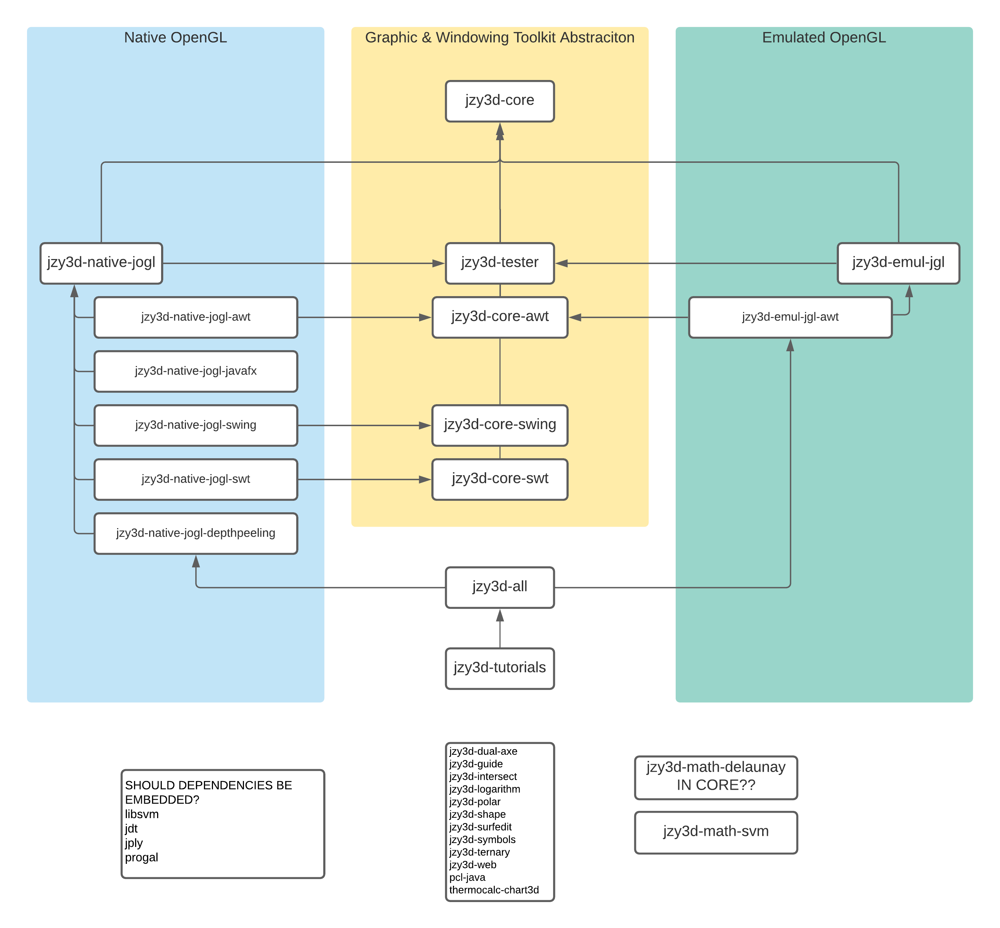
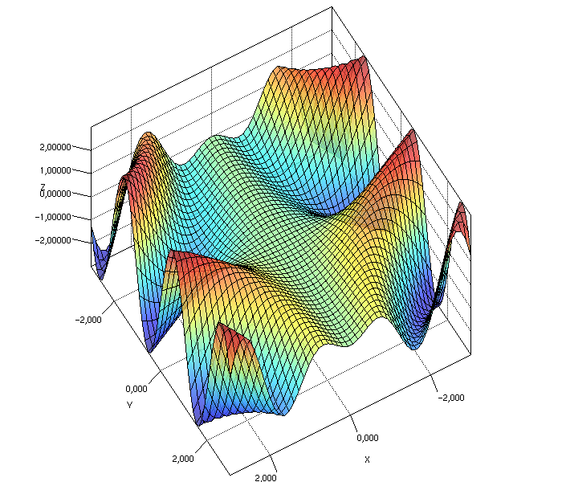

jzy3d-tutorials
===================

This module provides examples on how to create basic charts with Jzy3d.

For more example, refer to the complete [developer guide](http://jzy3d.org/documentation.php).

For more documentation about the framework design, see the API Readme file.


# Adding dependencies

See [pom.xml](pom.xml) file as an example.

## Add reference to Jzy3d Maven repository

```xml
<repositories>
  <repository>
    <id>jzy3d-snapshots</id>
    <name>Jzy3d Snapshots</name>
    <url>http://maven.jzy3d.org/snapshots/</url>
  </repository>
  <repository>
    <id>jzy3d-releases</id>
    <name>Jzy3d Releases</name>
    <url>http://maven.jzy3d.org/releases/</url>
  </repository>
</repositories>
```

## Add dependencies for native charts

These are the dependencies to use by default to enable JOGL Native Charts on Jzy3d.

```xml
<dependencies>
  <dependency>
    <groupId>org.jzy3d</groupId>
    <artifactId>jzy3d-native-jogl-awt</artifactId>
    <version>2.0.0-SNAPSHOT</version>
  </dependency>
  <dependency>
    <groupId>org.jzy3d</groupId>
    <artifactId>jzy3d-native-jogl-swing</artifactId>
    <version>2.0.0-SNAPSHOT</version>
  </dependency>
  <dependency>
    <groupId>org.jzy3d</groupId>
    <artifactId>jzy3d-native-jogl-newt</artifactId>
    <version>2.0.0-SNAPSHOT</version>
  </dependency>
  <dependency>
    <groupId>org.jzy3d</groupId>
    <artifactId>jzy3d-native-jogl-swt</artifactId>
    <version>2.0.0-SNAPSHOT</version>
  </dependency>

  <dependency>
    <groupId>org.jzy3d</groupId>
    <artifactId>jzy3d-tester-native</artifactId>
    <version>2.0.0-SNAPSHOT</version>
    <!-- not scoped test to demonstrate DebugGL in src/main/java -->
  </dependency>
</dependencies>
```

## Add dependencies for emulated charts

These are the dependencies to use to enable jGL Emulated OpenGL Charts on Jzy3d.

```xml
<dependencies>
  <dependency>
      <groupId>org.jzy3d</groupId>
      <artifactId>jzy3d-emul-gl-awt</artifactId>
      <version>2.0.0-SNAPSHOT</version>

  </dependency>

  <dependency>
    <groupId>org.jzy3d</groupId>
    <artifactId>jzy3d-tester</artifactId>
    <version>2.0.0-SNAPSHOT</version>
    <scope>test</scope>
  </dependency>

</dependencies>
```

Note that Emulated charts and native charts can both appear in the path.

The below map better illustrate how the API is splitted into Maven modules.



# Scatter charts

See ```ScatterDemo```


# Surface charts

See ```SurfaceDemoAWT```


# Waterfall charts

See ```WaterfallDemo```


# Volume charts

See ```LizardVolumeDemo```


# 2D Line charts

See ```Chart2DDemo```


# Debug charts

See ```DebugGL_Demo``` and modules ```jzy3d-tester```, ```jzy3d-tester-native```


# Test charts

See ```ITTestNativeSurfaceChart``` and ```ITTestNativeScatterChart``` for examples unit test showing how to verify no regression on a chart based on a pixel-wise comparison of the chart with a previously generated screenshot stored in ```src/test/resources```.

See ```ChartTester``` [README page](https://github.com/jzy3d/jzy3d-api/blob/emulgl/jzy3d-tester/README.md) for more information on Chart testing.  




# More charts

For more example, refer to the complete [developer guide](http://jzy3d.org/documentation.php).
